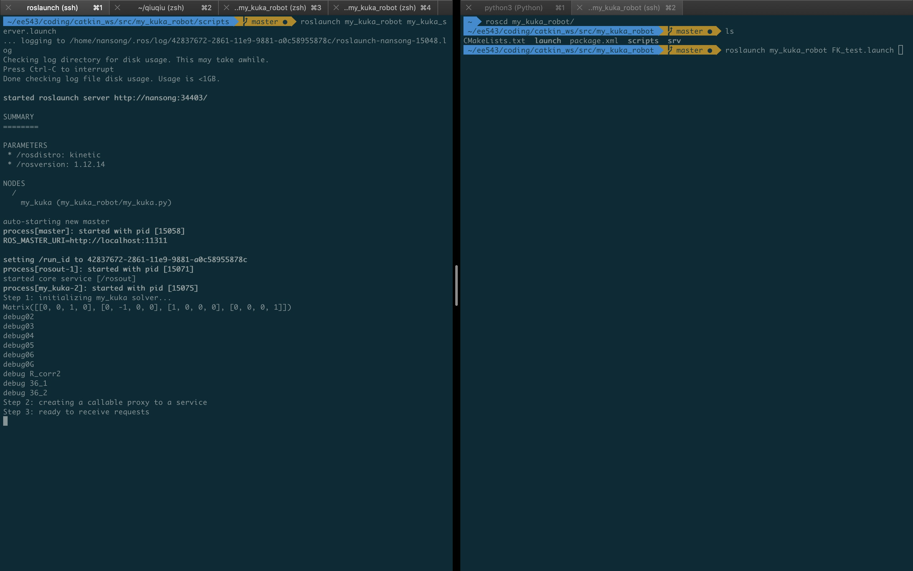
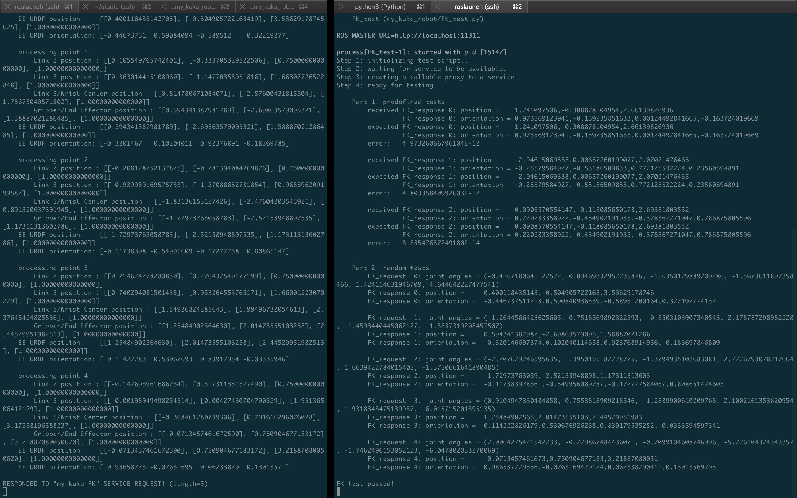

### my_kuka_robot

### FK_test

### Questions:

- Q1: Explain what  `rospy.Service()` and `rospy.ServiceProxy()` do respectively.
  - Basically,  `rospy.Service()` is like a server waiting for request and process it then return a response.
  - `rospy.ServiceProxy()` is like a client that request the server to do something.

- Q2: What happens if you take out the line `rospy.wait_for_service`, and why is it happening?
  - `rospy.service.ServiceException: service [/FK_service] unavailable`
  - Because sometimes service took a long time to initialize, if we don't `rospy.wait_for_service`, the request will not be processed and raise a `ServiceException:unavailable`
- Q3: What does the `---` in a service file mean?
  - Seperate the request(upper one) and response(lower one)
- Q4: In sympy, what does evalf function do?
  - Substitude symbols with given values (it could be another symbol)